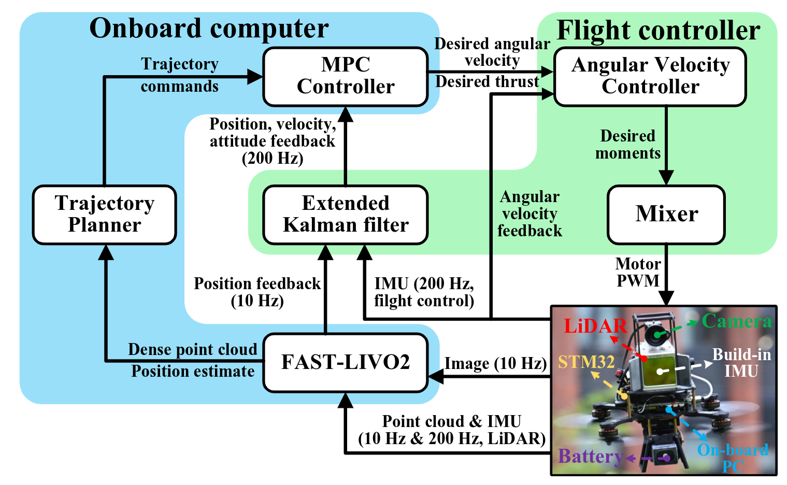

    <h1>Super Reproduction</h1>
     
    <a href="https://github.com/xiongzuming" target="_blank">Zuming X</a>,
    <a href="https://github.com/xiongzuming" target="_blank">Rongqing M</a>, and
    <a href="https://github.com/xiongzuming" target="_blank">Chao C</a>
     
     
    

        
    

     
      
      
    

# 1 Updates

* **June. 14, 2025** - add Super

# 2 Description

Work replay of Super

# 3 Result

## 3.1 Architecture

  

## 3.2 Experimental video

在室外环境中的最大速度10m/s

  

障碍物环境中规划

  

# 4 Installation

1. xxxx
2. xxxx
3. xxxx

# 5 Run

1. xxxx
2. xxxx
3. xxxx

# 6 Code Reference

1. xxxx
2. xxxx
3. xxxx

